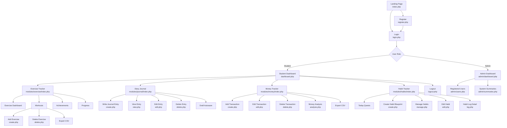
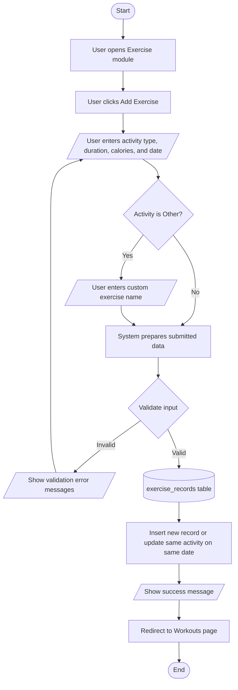
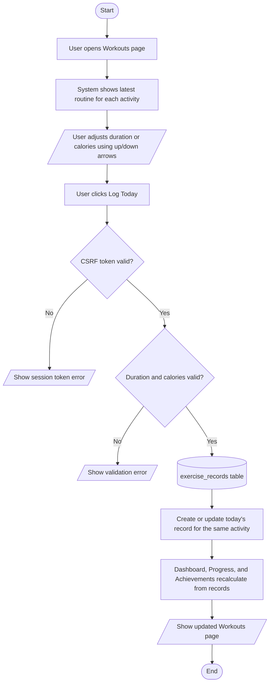
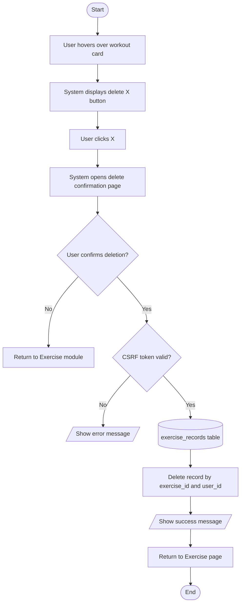
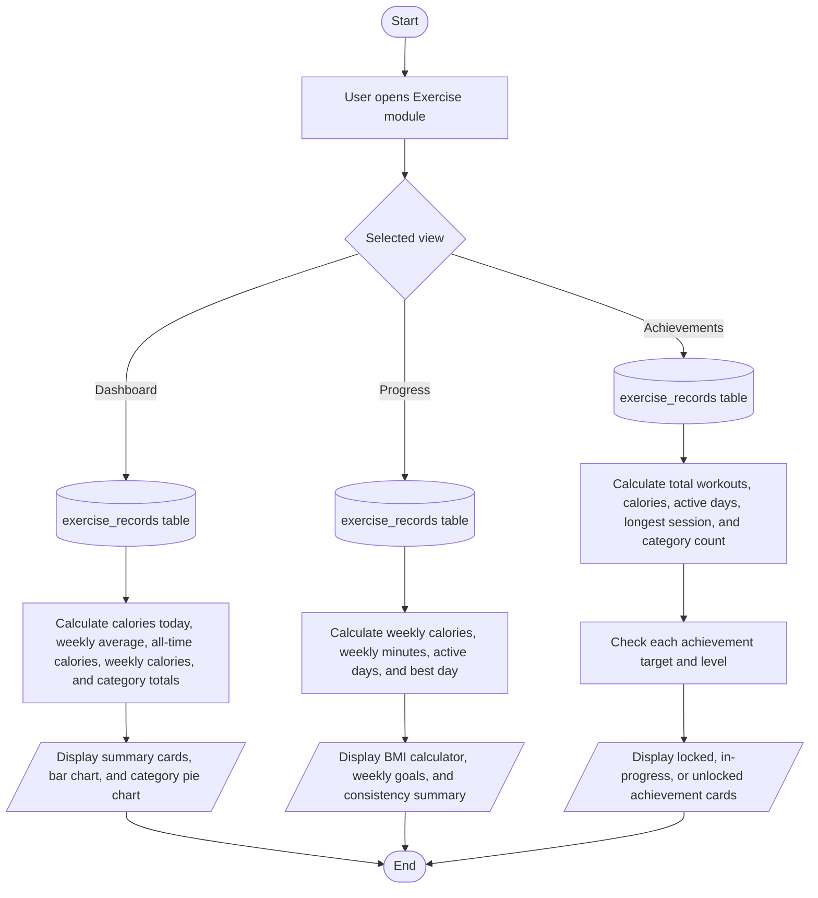
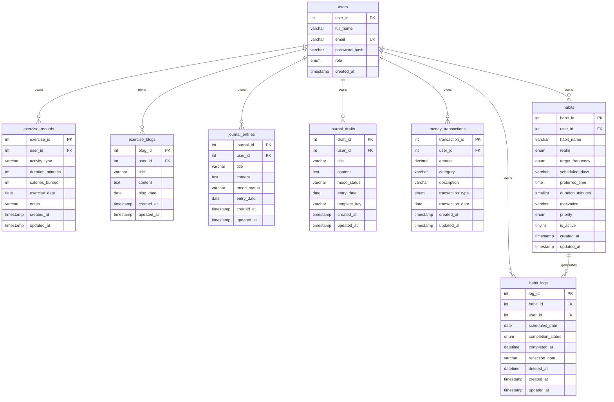

# Student Routine Organizer System Report

## 1. System Overview

The Student Routine Organizer is a web-based system for students to manage daily personal routines in one place. The system supports login, registration, role-based access, a student dashboard, admin summary pages, and four student modules:

- Exercise Tracker
- Diary Journal
- Money Tracker
- Habit Tracker

The system is built using PHP, MySQL, HTML, CSS, and JavaScript. It runs locally through XAMPP using Apache and MySQL. Each student must log in before accessing the dashboard and module pages. Most module data is stored with a `user_id`, so each student only sees and manages their own records.

## 2. Site Hierarchy and Navigation

### 2.1 Website Hierarchy Diagram

### 2.2 Navigation Explanation

Users first enter the system through the landing page. New users can register, while existing users log in using their email and password. After login, the system checks the user's role.

Student users are directed to the student dashboard. From the top navigation bar, they can move between the Dashboard, Exercise, Journal, Money, and Habits modules. Each module has its own listing page, create page, edit page, and delete flow where applicable.

Admin users are directed to admin pages where they can review total users and overall module summaries. The navigation also includes Logout, which ends the current session and prevents unauthenticated access to protected pages.

The Exercise Tracker module has its own internal navigation:

- Dashboard: shows exercise statistics and charts.
- Workouts: shows latest routines or full workout history.
- Achievements: shows unlockable exercise achievements.
- Progress: shows BMI calculator, weekly goals, and consistency progress.

## 3. Module Summary and Purpose

### 3.1 Exercise Tracker Module

Purpose: Allows students to record and manage physical activities such as running, cycling, gym sessions, swimming, walking, yoga, basketball, pickleball, badminton, and custom exercises. It helps students monitor workout duration, calories burned, dates, weekly progress, and achievements.

Suggested screenshot: Exercise Workouts page or Exercise Dashboard page.

### 3.2 Diary Journal Module

Purpose: Allows students to write private journal entries, track moods, save drafts, continue unfinished writing, and filter past entries.

Suggested screenshot: Journal index page showing entries and drafts.

### 3.3 Money Tracker Module

Purpose: Allows students to record income and expenses, categorize transactions, calculate balance, filter records, export CSV files, and review financial summaries.

Suggested screenshot: Money Tracker summary page.

### 3.4 Habit Tracker Module

Purpose: Allows students to create reusable habit blueprints, generate daily habit logs, complete or adjust daily quests, track weekly progress, and manage active or archived habits.

Suggested screenshot: Habit Tracker home page showing today's quests.

## 4. System Flowcharts for Exercise Tracker Module

### 4.1 Flowchart Notation

| Symbol | Meaning |
| --- | --- |
| Oval | Start or end of a process |
| Rectangle | Processing step performed by the system |
| Parallelogram | User input or system output |
| Diamond | Decision or validation condition |
| Cylinder | Database storage or retrieval |
| Arrow | Direction of process flow |

### 4.2 Add Exercise Flowchart

### 4.3 Log Today Flowchart

### 4.4 Delete Exercise Flowchart

### 4.5 Exercise Dashboard, Progress, and Achievements Flowchart

## 5. Overview of Database Structure

### 5.1 Database Schema Diagram

### 5.2 Database Relationship Explanation

The `users` table is the parent table for student and admin accounts. Each user has a unique `user_id`, and module tables store this `user_id` as a foreign key. This allows the system to separate one student's data from another student's data.

The Exercise Tracker stores workout data in `exercise_records`. Each record belongs to one user and includes the activity type, duration, calories burned, exercise date, and optional notes. Exercise dashboard cards, charts, goals, and achievements are calculated from this table.

The Journal module stores published entries in `journal_entries` and unfinished writing in `journal_drafts`. Both tables use `user_id`, so drafts and entries can be retrieved only for the logged-in user.

The Money module stores income and expense records in `money_transactions`. The system calculates income totals, expense totals, and balance by filtering this table by `user_id`.

The Habit module separates reusable habit plans from dated progress logs. The `habits` table stores habit blueprints such as name, realm, frequency, scheduled days, preferred time, motivation, and priority. The `habit_logs` table stores daily scheduled habit records and completion status. Each habit can generate many logs, and both tables still include `user_id` to keep records user-specific.

## 6. Functional Requirements for Exercise Tracker Module

### Feature 1: Add Exercise Record

User action: The user clicks Add Exercise and enters an activity type, duration, calories burned, and exercise date. If the activity type is Other, the user can type a custom exercise name.

System process: The system validates the submitted form, checks the CSRF token, and saves the record into `exercise_records`. If the same user already has the same activity on the same date, the system updates that record instead of creating a duplicate.

Data involved: `user_id`, `activity_type`, `duration_minutes`, `calories_burned`, `exercise_date`.

Validation rules: Activity type is required. Custom activity names cannot exceed 60 characters and can only use simple characters. Duration must be a whole number from 1 to 1440 minutes. Calories must be a whole number from 0 to 20000. Exercise date must be valid.

Expected outcome: A new exercise record is saved, and the user is redirected to the Workouts page with a success message.

### Feature 2: View Workout Records

User action: The user opens the Workouts page.

System process: The system retrieves exercise records that belong to the logged-in user. By default, it shows the latest record for each activity so repeated routines do not overcrowd the page. The user can switch to View History to see all records.

Data involved: `exercise_id`, `activity_type`, `duration_minutes`, `calories_burned`, `exercise_date`.

Validation rules: The system uses the logged-in `user_id` when retrieving records, so users cannot view another user's exercises.

Expected outcome: The user can review their latest routines or full workout history in a clean card layout.

### Feature 3: Filter, Sort, and Search Workout History

User action: In history mode, the user can search by activity, filter by activity type, filter by date range, and sort the results.

System process: The system builds a filtered query using the selected conditions and returns only matching records for the logged-in user.

Data involved: Search keyword, activity type, date from, date to, sort option, and `user_id`.

Validation rules: Invalid activity options and invalid dates are ignored or reset. Sort options must match the accepted list.

Expected outcome: The user sees a more focused list of exercise records based on the selected filters.

### Feature 4: Log Today from Existing Routine

User action: The user adjusts duration and calories directly on a workout card using up/down arrows, then clicks Log Today.

System process: The system submits the selected activity, adjusted duration, adjusted calories, and today's date. It validates the data and saves it as today's workout. If today's record already exists for that activity, it updates the existing record.

Data involved: `activity_type`, `duration_minutes`, `calories_burned`, today's `exercise_date`, and `user_id`.

Validation rules: Duration and calories must still follow the normal number limits. CSRF token must be valid.

Expected outcome: The user can repeat daily routines quickly without filling in the full Add Exercise form every day.

### Feature 5: Delete Exercise Record

User action: The user hovers over a workout card and clicks the X delete control, then confirms deletion on the delete page.

System process: The system checks that the selected exercise record belongs to the logged-in user. After confirmation, it deletes the record from `exercise_records`.

Data involved: `exercise_id`, `user_id`.

Validation rules: Exercise ID must be valid. CSRF token must be valid. The record must belong to the logged-in user.

Expected outcome: The exercise record is removed and no longer appears in workouts, dashboard calculations, progress, or achievements.

### Feature 6: Export Exercise Records to CSV

User action: The user clicks Export CSV from the Workouts page.

System process: The system retrieves the current user's exercise records and outputs them as a CSV file.

Data involved: Activity type, duration minutes, calories burned, exercise date.

Validation rules: Only records owned by the logged-in user are exported.

Expected outcome: The browser downloads a file named `exercise-tracker-export.csv` for external use or backup.

### Feature 7: Exercise Dashboard Analytics

User action: The user opens the Exercise Dashboard tab.

System process: The system calculates calories burned today, average daily calories over the last 7 days, all-time calories, total calories this week, weekly bar chart values, and workout category totals.

Data involved: `duration_minutes`, `calories_burned`, `activity_type`, `exercise_date`.

Validation rules: Dashboard statistics only use records owned by the logged-in user.

Expected outcome: The user can quickly understand current exercise effort and compare weekly calorie activity through charts.

### Feature 8: Progress Tools and Weekly Goals

User action: The user opens the Progress tab, enters height and weight for BMI, and sets weekly calorie and minute goals.

System process: The BMI calculator estimates BMI in the browser. The goal tracker compares weekly calories and active minutes against user-selected goals. The consistency panel shows active days, best day, and peak date.

Data involved: Height, weight, weekly calorie goal, weekly minute goal, `duration_minutes`, `calories_burned`, `exercise_date`.

Validation rules: BMI inputs must be within reasonable ranges. Weekly goal inputs must follow valid number steps and limits. Exercise progress is calculated from valid exercise records.

Expected outcome: The user can monitor weekly exercise goals and understand whether their current activity level is improving.

### Feature 9: Achievements

User action: The user opens the Achievements tab.

System process: The system calculates total workouts, total calories, active days, longest session, category count, weekly calories, and weekly minutes. It compares these values against achievement targets. Some achievements have three levels using Roman numerals, while First Workout and Sport Explorer are single achievements.

Data involved: `exercise_records` values including activity type, duration, calories, and date.

Validation rules: Achievements are calculated only from records belonging to the logged-in user. Level-based achievements only unlock after the final level is completed.

Expected outcome: The user receives progress-based motivation and can unlock fitness awards by consistently recording normal, achievable workout activity.

## 7. Screenshot Recommendation

Only one screenshot per module is needed to keep the report readable. Recommended screenshots:

1. Exercise Tracker: Workouts page showing exercise cards and Log Today.
2. Diary Journal: Journal page showing entries and drafts.
3. Money Tracker: Money dashboard showing income, expenses, and balance.
4. Habit Tracker: Habit page showing today's quests and progress.

These screenshots should be placed after the module summary section or in an appendix.

## 8. Conclusion

The Student Routine Organizer provides a structured personal management system for students. Its navigation is simple because all major modules are accessible from the main dashboard and top navigation bar. The database design uses `user_id` relationships to keep each student's data separate and secure. The Exercise Tracker module supports the full record-management cycle of adding, viewing, adjusting, deleting, exporting, analyzing, tracking progress, and unlocking achievements, which aligns with the purpose of helping students manage health and fitness activities.
